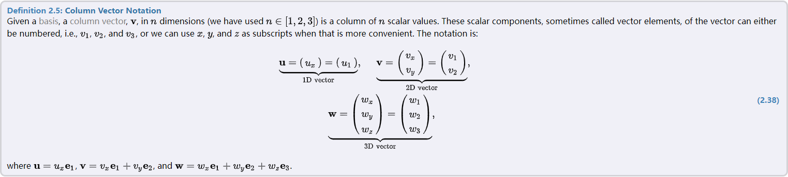

<!-- TOC -->

- [1. $\textcolor{red}{Immersive}$ linear algebra](#1-textcolorredimmersive-linear-algebra)
  - [1.1. Brief Note on Notation](#11-brief-note-on-notation)
- [2. Vectors](#2-vectors)
  - [2.1. Properties of Vector $\textcolor{red}{Arithmetic}$](#21-properties-of-vector-textcolorredarithmetic)
  - [2.2. Vector Bases and Coordinates](#22-vector-bases-and-coordinates)
- [3. The Dot product](#3-the-dot-product)
  - [3.1. Definition and Applications](#31-definition-and-applications)

<!-- /TOC -->

# 1. $\textcolor{red}{Immersive}$ linear algebra
"A picture says more than one thousand words" is a common expression. It is often the $\textcolor{red}{case}$ that a figure or an $\textcolor{red}{illustration}$ can replace a large number of words as well. However, we believe that an interactive illustration can say even more, and that is why we have decided to build our linear algebra book around such illustrations. We believe that these figures make it easier and faster to digest and learn linear algebra(which would be the case for many other mathematical books as well). In addition, we have added some more figures (e.g., popup windows for common linear algebra terms) to our book, and we believe that those features will make it easier and faster to read and understand as well.

After using linear algebra for 20 years times three persons, we were ready to write a linear algebra book that we think will make it substantially easier to learn and to teach linear algebra. In addition, the technology of mobile devices and web browsers have improved beyond a certain threshold, so that this book could be put together in a very $\textcolor{red}{novel}$ and $\textcolor{red}{innovative}$ way(we think). we believe it is easier to understand the entire topic of linear algebra with a simple and concrete example cemented into the reader's mind in the beginning of each chapter.

## 1.1. Brief Note on Notation
A number, in the common sense, may be positive, negative, it may have $\textcolor{red}{decimals}$. and it may $\textcolor{red}{rational}$ or $\textcolor{red}{irrational}$, the set of all such numbers are denoted by $\R$ ,and the numbers are said to be real numbers. We often use the term a $\textcolor{red}{scalar}$ instead of saying a real number.

The $\textcolor{red}{cosine}$, sine and tangent.
$$
c^2 = a^2 + b^2 - 2abcos\gamma
$$

$$
\frac{sin\alpha}{a} = \frac{sin\beta}{b} = \frac{sin\gamma}{c}
$$

# 2. Vectors
Here, we will show you the $\textcolor{red}{concept}$ of a vector in action. A vector is often visualized as an arrow. In this interactive illustration, which actually is a small game, the direction and the velocity of a moving ball is vector. The orientation of the arrow reveals its direction, while the length is proportional to the ball's speed. 

## 2.1. Properties of Vector $\textcolor{red}{Arithmetic}$

1. $\bm{u} + \bm{v} = \bm{v} + \bm{u}$; ($\textcolor{red}{commutativity}$)
2. $(\bm{u} + \bm{v}) + \bm{w} = \bm{v} + (\bm{u}+\bm{w}) $ ; ($\textcolor{red}{associativity}$)

while most(or all) of the rules above feel very $\textcolor{red}{natural}$ and $\textcolor{red}{intuitive}$, they must be proved $\textcolor{red}{nevertheless}$.

## 2.2. Vector Bases and Coordinates
Most of you are probably $\textcolor{red}{familiar}$ with the $\textcolor{red}{concept}$ of a coordinate system. 

In fact, the two axis may be $\textcolor{red}{arbitrary}$ (as long as they are not parallel), and therefore, we can view the axes as vectors, $\bf{e_1}$ and $\bf{e_2}$, instead.

Let $\bf{e_1}$ and $\bf{e_2}$ be two parallel vectors (which both lie in a plane). For every vector, **v**, there is a single coordinate pair(x,y), such that 
$$
\bf{v} = x\bf{e_1} + y\bf{e_2}
$$

# 3. The Dot product
This chapter is about a powerful tool called the **dot product**. It is one of the essential building blocks in computer graphics. There is a computer graphics program called a **ray tracer**. The idea of a ray $\textcolor{red}{tracer}$ is to generate an image of a set of geometrical objects(in the case below, there are only spheres).

In the ray tracing problem above, the dot product was used to calculate the intersection between a ray and sphere, and the dot product was also used to measure the length to the intersection points. 

## 3.1. Definition and Applications
The dot product between two vectors, **u** and **v** is denoted $\bf{u} \cdot \bf{v}$,and is defined as the scalar value
$$
\bf{u} \cdot \bf{v} = ||u|||v||cos[u,v]
$$

if the two vectors **u** and **v** are $\textcolor{red}{orthogonal}$($\textcolor{red}{perpendicular}$)

A unit vector is a vector whose length is 1, that is, **v** is a unit vector if ||v||=1. From every non-zero vector v, a unit vector can be create. This is called to normalize the vector, and the process is called normalization. A normalized vector **n** is created from **v** by dividing **v** by its length ||v||.

If **v** is non-zero vector, then the $\textcolor{red}{orthogonal}$ projection of **u** onto **v** is denoted $\rho_vU$ and is defined by 
$$
\rho_vU = \frac{U \cdot V}{||V||^2}V
$$

With the help of the definition and the projection formula, it is now possible to deduce the following rules:
1. $u \cdot v$ = $v \cdot u$;(commutativity)
2. $k(u \cdot v) = (ku) \cdot v$; (associativity)
3. $v\cdot (u+w) = v\cdot u + v\cdot w;(\textcolor{red}{distributivity}$)
4. $v \cdot v = ||v||^2$;(squared length)

Definition: $\textcolor{red}{Orthonormal}$ Basis
For an n-dimensional orthonormal basis, consisting of the set of basis vectors, ${e_1,e_2,...e_n}$,the following holds

$$
e_i \cdot e_j = 1, if i=j, or e_i \cdot c_j=0,if i\neq j;
$$

