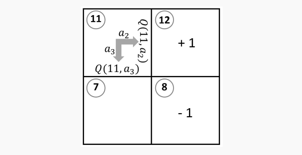

<!-- TOC -->

- [1. Chapter 1](#1-chapter-1)
  - [1.1. What is reinforcement learning](#11-what-is-reinforcement-learning)
  - [1.2. A Crawling Robot](#12-a-crawling-robot)
  - [1.3. Formulation of Reinforcement Learning Problems](#13-formulation-of-reinforcement-learning-problems)
    - [1.3.1. The general setting](#131-the-general-setting)
    - [1.3.2. A simple example](#132-a-simple-example)
    - [1.3.3. The utility of value functions](#133-the-utility-of-value-functions)
    - [1.3.4. policy $\textcolor{red}{extraction}$](#134-policy-textcolorredextraction)
  - [1.4. Solution Approaches](#14-solution-approaches)
    - [1.4.1. Model of Markov Dynamic Process](#141-model-of-markov-dynamic-process)
    - [1.4.2. Module-based approaches](#142-module-based-approaches)
    - [1.4.3. Model-free approaches](#143-model-free-approaches)
  - [1.5. Deep Reinforcement Learning](#15-deep-reinforcement-learning)
    - [1.5.1. Deep Q-network(DQN)](#151-deep-q-networkdqn)
- [2. Markov Decision Processes](#2-markov-decision-processes)
  - [2.1. $\textcolor{red}{Definitions}$](#21-textcolorreddefinitions)
  - [2.2. Elements of Markov Decision Process](#22-elements-of-markov-decision-process)
    - [2.2.1. The bellman Equation](#221-the-bellman-equation)

<!-- /TOC -->

# 1. Chapter 1
The emphasis is on providing a $\textcolor{red}{streamlined}$ $\textcolor{red}{exposition}$ (at the $\textcolor{red}{expense}$ of $\textcolor{red}{rigor}$ and completeness) on these key methods. 

## 1.1. What is reinforcement learning
Imaging a baby is trying to learn how to $\textcolor{red}{crawl}$ on the floor to chase a small moving toy car. On subsequent occasions when the baby sees the toy can move around. As this "try and recall" $\textcolor{red}{cycle}$ repeats many times, the baby will finally learn the "best" movement pattern and can execute it seemingly $\textcolor{red}{effortlessly}$.

The traditional approach to realize such a crawling robot is to first study a baby's learned patterns of $\textcolor{red}{limb}$ movement during crawling, and then to program the movement of mechanical legs of the robot in order to $\textcolor{red}{mimic}$ the baby's $\textcolor{red}{coordinated}$  patterns of limb movement.

In the $\textcolor{red}{narrow}$ context of this learning-to-$\textcolor{red}{crawl}$ $\textcolor{red}{scenario}$. 

## 1.2. A Crawling Robot
We will use this example to illustrate the key aspects of this solution approach. 

*state*: If we refer to each configuration, i.e., each pair of $(\theta_1,\theta_2)$.

*transition*: when a robot moves from one state to another, its configuration changes. 

*state transition diagram*: contains all possible transition sequences. 

$\textcolor{red}{trial-and-error}$

In other words, the amount of reward is represented by the speed of the crawling motion. The robot controller will then
1. evaluate the relative importance(or 'worth') of each link configuration (i.e., state) in the generation of such forward motion,
2. quantify this worth in terms of a numerical value - which we simple call the Q values in this chapter, and 
3. sorted the Q values for subsequent evaluation.

## 1.3. Formulation of Reinforcement Learning Problems

This section presents a $\textcolor{red}{streamlined}$ and intuitive narrative on 
1. how a reinforcement learning problem can be formulated, and 
2. a selected set of key approaches currently available to solving it,

$\textcolor{red}{Certain}$ $\textcolor{red}{gaps}$ are left unfilled and details omitted in order to keep the exposition accessible with minimal requirement of $\textcolor{red}{prior}$ knowledge.This section is intended to serve as a $\textcolor{red}{precursory}$ $\textcolor{red}{preparation}$ for the more technical discussion in the subsequent chapters.

### 1.3.1. The general setting

Reinforcement learning $\textcolor{red}{concerns}$ the problem of an "$\textcolor{red}{autonomous}$" $\textcolor{red}{entity}$ that learns from its interaction with its environment while preforming a task. This entity is called the $\textcolor{red}{agent}$. while whatever external entities that the agent interacts with is (collectively) called $\textcolor{red}{environment}$.

The agent-environment interaction is  $\textcolor{red}{characterized}$ by the $\textcolor{red}{actions}$ (denoted by $a$),The specific condition (or $\textcolor{red}{circumstance}$) under which the agent takes an action is called a $\textcolor{red}{state}$(denoted by $s$). The deterministic relationship between a state and an action is called a $\textcolor{red}{policy}$ (denoted by $\pi$); that is, if the agent at state $s$ takes actions $a$, then we write $\pi(s)=a$. Taking an action has two consequences that are recognized after a time delay(denoted by $\Delta t$)

An agent may carry out a task $\textcolor{red}{indefinitely}$ or terminate it at some state. A task that runs indefinitely is referred to as *continuing*, while one that ends at some state is referred to as $\textcolor{red}{episodic}$. A cleaning robot (i.e. the agent) continuously roaming one floor of an office building (the environment) and picking up $\textcolor{red}{discarded}$ $\textcolor{red}{items}$ while $\textcolor{red}{recharging}$ itself $\textcolor{red}{occasionally}$ is performing a $\textcolor{red}{continuing}$ task. A $\textcolor{red}{mobile}$ robot (the agent) in a $\textcolor{red}{maze}$ (environment) finding a way to the $\textcolor{red}{exit}$ is performing an episodic task.

value function:
1. state value function $v(s)$,$\textcolor{red}{represents}$ the "worth" of an agent being at a specific state $s$. 
2. action value function $q(s,a)$, represents the "worth" of an agent being at a specific state $s$ and taking a specific action $a$. 

### 1.3.2. A simple example
$\textcolor{red}{treasure-hunting}$ $\textcolor{red}{scenario}$: A treasure box in placed at the top right $\textcolor{red}{corner}$ of a walled region.A $\textcolor{red}{deathtrap}$ has been set to the south of the treasure box. A mobile robot is currently located at the $\textcolor{red}{lower}$ left corner of the walled region.A $\textcolor{red}{hill}$ blocks the direct access of the robot to the treasure box. The task of the robot is to move through the walled region, with the objective of reaching the treasure box.

The behavior of the root when taking an action is defined to $\textcolor{red}{reflect}$ the $\textcolor{red}{confined}$ geometry of the region and the blocking effect of the hill. Normally the robot at the state $s$ can take one of four actions, i.e., to move up($a_1$),right($a_2$),down($a_3$), or left($a_4$). and after taking an action the robot will end up in the $\textcolor{red}{adjacent}$ state in the direction of that action. This can be expressed by a $\textcolor{red}{so-called}$ *deterministic transition function*, denoted by $f^-(s,a)$, whose output is the new state $s'$. For instance, when the robot at state 5 takes action $a_2$ to go right (towards the hill), it will remain in state 5 after taking actions, i.e., $f^-(5,a2) = 5$. A transition can be probabilistic. $f^(s,a,s^{'})=0.5$, where $f(s,a,s^{'})$ is called probabilistic transition function.

Third, to indicate the $\textcolor{red}{desire}$ for reaching the treasure box while avoiding the $\textcolor{red}{deathtrap}$, a reward $\textcolor{red}{scheme}$ is set up such that the robot will receive a reward of +1 and -1 when it enters state 12 and 8, respectively.  The reward scheme can be expressed using the so-called *reward* function, denoted by $\overline{p}(s,a,s')$.

With the states,actions,the reward function, and the transition function thus established. we have now cast the treasure-hunting reinforcement-learning problem in the framework of the so-called Markov Decision Processes($\textcolor{red}{MDP}$). we will next discuss (in general terms) how a solution can be obtained for this reinforcement learning problem.

### 1.3.3. The utility of value functions
Two value functions:
1. One represents the worth of state $s$, denoted by $v(s)$;
2. The other represents the worth of a state-action pair $(s,a)$, denoted by $q(s,a)$;

For instance, the state-action values of the state $s$ as shown in Fig.1,5 are:

$$q(s,a1)=0.94,q(s,a2)=0.95 ... $$

If the robot were to choose two between these two actions under two policies $\pi_i(11)=a_2$ and $\pi_j(11)=a_3$, obviously is should choose $\pi_i$ over $\pi_j$. with $q_{\pi(*)}(s,a)$ represents the value of the state-action function $q(s,a)$ under the policy $\pi(*)$.

### 1.3.4. policy $\textcolor{red}{extraction}$
1. determining the value of $q_*(s,a)$  for every state-action pair, then
2. $\pi_*(s)=argmax_aq_*(s,a)$

## 1.4. Solution Approaches

### 1.4.1. Model of Markov Dynamic Process

### 1.4.2. Module-based approaches

If a well-defined model is available, a recursive relationship between the optimal values of two states related by the transition function can be analytically established. This recursive relationship is called the **Bellman Optimality Equation**. 

There are two main approaches to solving the Bellman optimality equation. One is to solve it $\textcolor{red}{algebraically}$, i.e., by solving a set of simultaneous equations. The other is to solve it $\textcolor{red}{via}$ some $\textcolor{red}{iterative}$ process. 

An algorithm that implements policy iteration would execute the following steps:
1. Generate a random policy $\pi$;
2. [Policy evaluation] Go through an iterative process to obtain a close estimate, denoted by $V_\pi(s)$, of the state values $v_\pi(s)$ for the policy $\pi$,i.e., $V_\pi(s) \approx v_\pi(s)$
3. [policy improvement] Find a better $\pi'>\pi$ based on the values $V_\pi(s)$
4. Repeat 3 and 4 until no $\pi' > \pi$

Solving model-based reinforcement learning problems using Dynamic Programming has two key drawbacks. First, a well-defined model(in the Markov Decision Process ) is required. Second, the solution process is similar to $\textcolor{red}{exhaustive}$ search. which is $\textcolor{red}{computationally}$ intensive.

### 1.4.3. Model-free approaches

Model-free approaches do not require transition function and the reward function to be available at the state of the solution precess. There are two main classes of model-free methods, One is the **$\textcolor{red}{Monte}$ Carlo methods**; the other is the **Temporal Difference methods**

**Monte carlo methods**: Finding approximate solutions to mathematical problems using 'experience' gained by random sampling processes. 

The main drawback of applying the Monte carlo $\textcolor{red}{technique}$ in solving reinforcement learning problems is that estimation of either $v_\pi(s)$ or $q_\pi(s,a)$ relies on episodic random sampling, whose outcome can only be calculated upon the $\textcolor{red}{completion}$ of an episode. 

**Temporal Difference methods**

The core idea of Temporal Difference methods is to update the selected values $V(s)$ or $Q(s,a)$ iteratively using an update rule that involves an error term and can be expressed in the following general form:

**TD(0)**: The TD(0) method is designed for policy evaluation (i.e., prediction). For a given policy $\pi$, this method randomly selects some initial values for $v(s)$, then executes the update rule as given in Equation(1.4) iteratively until the update value converges to some close estimate of $v_\pi(s)$.

**Q-learning**
**SARSA**

## 1.5. Deep Reinforcement Learning
In Q-learning, the main task is to find an optimal state-action values $Q_*(s,a)$. Implementation of Q-learning, using the update rule as given in Equation(1.4), requires storage and $\textcolor{red}{retrieval}$ of intermediate values of $Q(s_j,a_j)$, for a state-action pairs $(s_j,a_j)$. The usual practice is to use some data structure (e.g., a $\textcolor{red}{matrix}$) for this purpose.  we can simply think of the data structure as a "look-up table" fro the values of $Q(s_j,a_j)$, or simply a Q-table.

$\textcolor{red}{computationally}$ $\textcolor{red}{intractable}$

### 1.5.1. Deep Q-network(DQN)

In Q-learning, we "look up" the value $Q(s_j,a_j)$ from the Q-table for a given state action pair $(s_j,a_j)$, Suppose that there are M actions that the agent can choose from at state $s_i$. we can think of the Q-table as a vector function, denoted by $f(.),$, that when provided with a state $s_i$ as input produces the vector  **q** as output.

Because neural networks are universal approximations, we can be assured that a suitably designed neural network $g(s_i,\bm{W})$ is $\textcolor{red}{capable}$ of approximating the function $f(s_i)$ that represents the Q-table as discussed earlier.

For a given input $s_i$, Computing the vector $y_{nn}$ using a neural network $g(s_i,\bm{W^*})$, i.e., $y_{nn} =g(s_i,\bm{W^*})$, is much less computationally intensive than using the original Q-table, because the size of the neural network(as reflected by $\bm{W^*}$) is much smaller than the size of Q-table. 

# 2. Markov Decision Processes

## 2.1. $\textcolor{red}{Definitions}$

Let $\R$ denote the set fo real numbers, and $\R^n$ denote an n-dimensional space of real numbers. 

$$
f(s,a)=s', s,s'\in  S, a\in A
$$

and, in terms of mapping,as
$$
f:S \times A \rightarrow S
$$

$\mathbb{E}$ called the expectation operator:
$$
\mathbb{E}[x] = x_1p_1+x_2p_2+...x_kp_k
$$

## 2.2. Elements of Markov Decision Process
A Markov Decision Process is a model of a dynamical system $\textcolor{red}{comprising}$ of the following elements, namely,state,action,transition function and reward. 

The reward received by the agent for reaching the four different new states are(as given  in the figure).

and the transition functions are :

Thus, the expected reward for taking action at state s, denoted by $r(s,a)$, at time step t is 

* Probabilistic transition function $f(s,a,s')$
$$
f(s,a,s')=p(s'|s,a)=\mathbb{P}\{S-t=s'|S_{t-1}=s,A_{t-i}=a\}=\sum{p(s',s|s,a)}
$$

The expected reward for the state-action pair (4,+1) is

$$
\begin{aligned}
r(s,a) &= r(4,+1) \\
&=\mathbb{E}[R_t|S_{t-1}=4,A_{t-1}=+1] \\
&=\sum_{r\in R}\sum_{s'\in S} r \cdot p(s',r|s,a) (Note: r \in {0,1,3,5};s' \in {3,4,5})\\
&=\sum_{r\in R}\sum_{s'\in S} r \cdot f(s,a,s') \cdot \rho(r|s') \\
&=\sum_{r\in R} r f(4,+1,5)\rho(r|5) + rf(4,+1,4)\rho(r|4) + rf(4,+1|3)\rho(r|3)\\
&=0 \cdot f(4,+1,5)\rho (0|5) + 0 \cdot f(4,+1,4)\rho (0|4) + 0 \cdot f(4,+1,3)\rho (0|3)  \\
&+ 1 \cdot f(4,+1,5)\rho (1|5) + 1 \cdot f(4,+1,4)\rho (1|4) + 1 \cdot f(4,+1,3)\rho (1|3) \\
&+3 \cdot f(4,+1,5)\rho (3|5) + 2 \cdot f(4,+1,4)\rho (3|4) + 2 \cdot f(4,+1,3)\rho (3|3) \\
&+ 5 \cdot f(4,+1,5)\rho (5|5) + 5 \cdot f(4,+1,4)\rho (5|4) + 5 \cdot f(4,+1,3)\rho (5|3)\\
&=1 \times 0.8\times 0.2+ 3\times 0.8\times 0.3 + 5\times 0.8 \times 0.1 \\
&=1.28
\end{aligned}
$$

We note that the return at time step t can be expressed in terms of return in the next time $t+1$:

### 2.2.1. The bellman Equation
In general, the Bellman Equation describes a relationship between the value of a state $v_\pi(s)$(or of a state-action $q_\pi(s,a$) and the the value of its successor states $v_\pi(s')$,(or a state-action pairs $q_\pi(s',a')$). We look first at the case of state value, under the general assumption that the transition, reward, and policy are all non-deterministic.

we start with the definition of the state value function under policy $\pi$ given in Equation(2.41)，Now:

