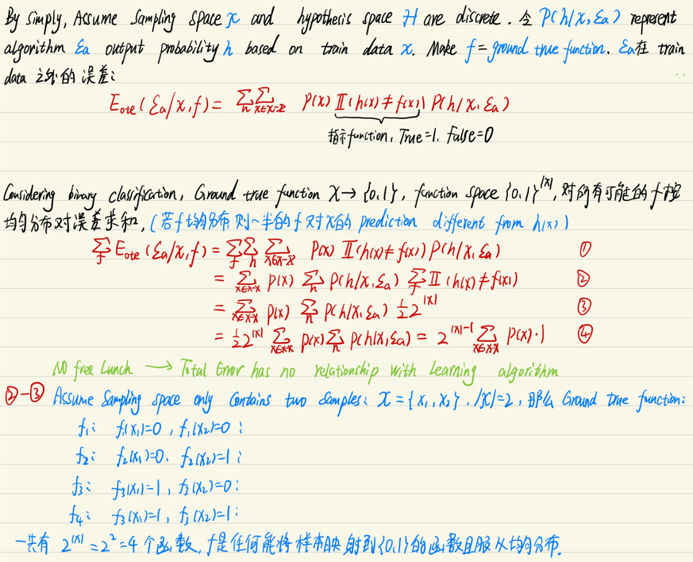
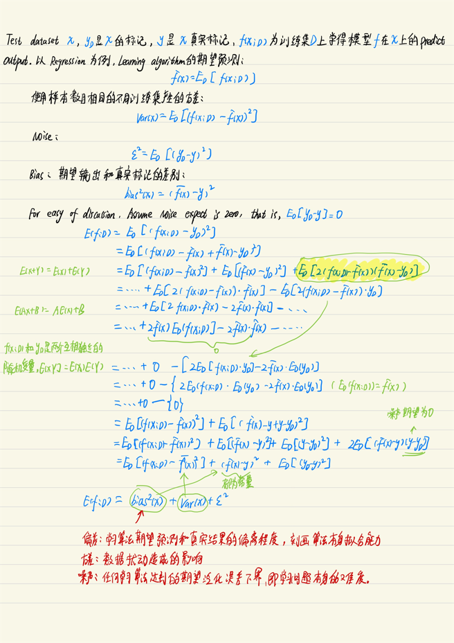
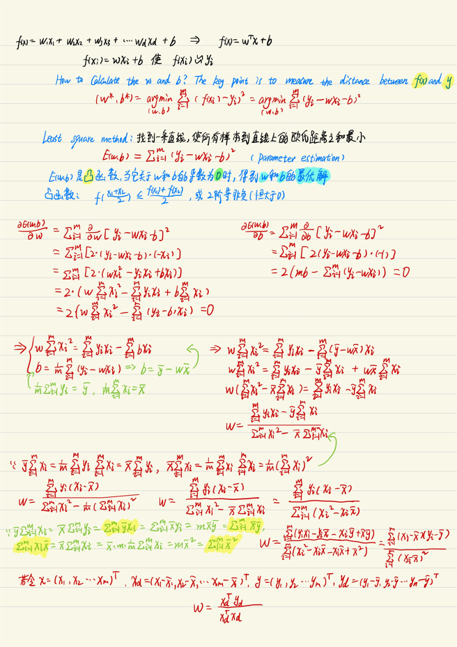
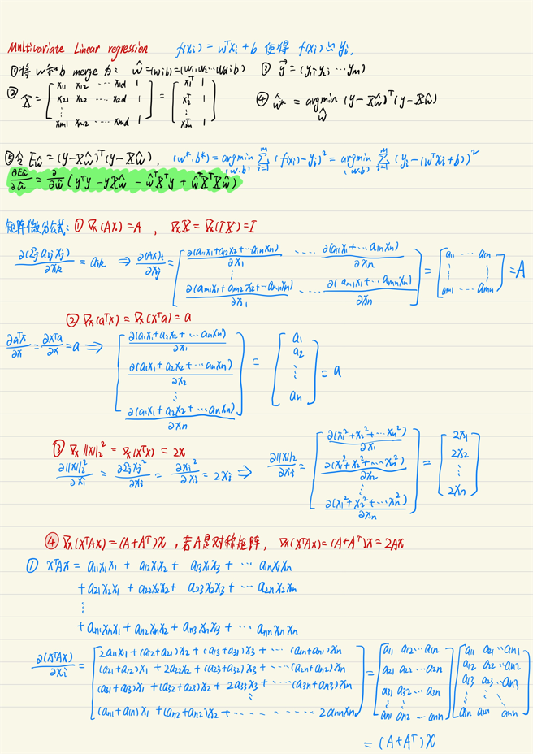
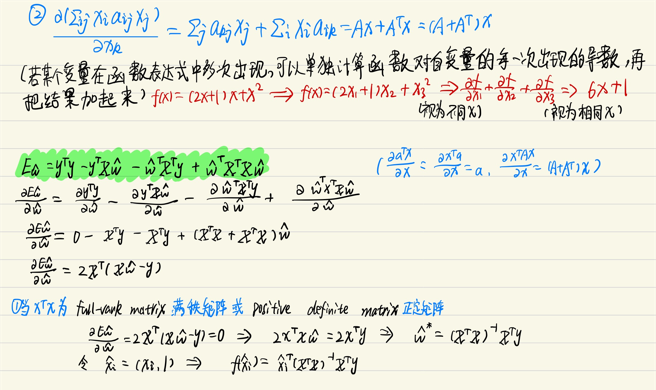
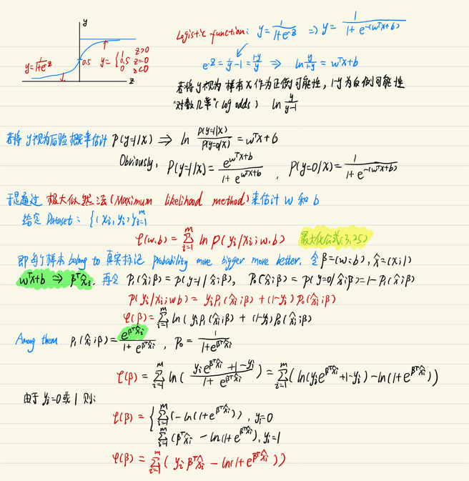
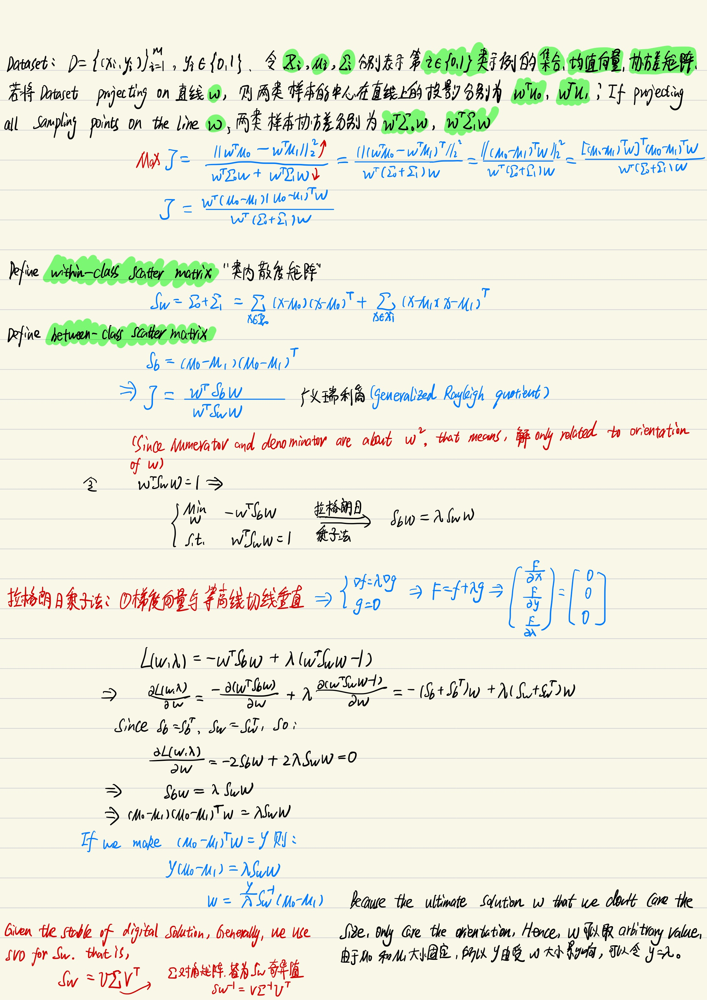
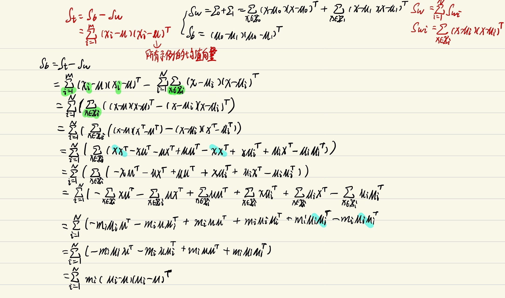

<!-- TOC -->

- [1. 绪论](#1-绪论)
- [2. 模型评估和选择](#2-模型评估和选择)
  - [2.1. 经验误差与过拟合](#21-经验误差与过拟合)
  - [2.2. 偏差和方差](#22-偏差和方差)
- [3. 线性模型](#3-线性模型)
  - [3.1. 对数几率回归](#31-对数几率回归)
  - [3.2. 线性判别分析](#32-线性判别分析)

<!-- /TOC -->

# 1. 绪论
Supervised Learning
Unsupervised Learning
generalization "泛化"
Generally we assume that all sampling space obey a distribution $D$,our samples all independent and identically distributed.(i,i,d)
induction 归纳 ——> generalization
deduction 演绎 ——> specialization

在这里我们假设真实的目标函数$f$为“任何能将样本映射到{0,1}的函数且服从均匀分布”，但是实际情形并非如此，通常我们只认为能高度拟合已有样本数据的函数才是真实目标函数，例如，现在已有的样本数据为${(x_1,0),(x_2,1)}$,那么此时$f_2$才是我们认为的ground true function. Since we haven't collect or even they don't exist {(x_1,0),(x_2,0)},{(x_1,1),(x_2,1)},{(x_1,1),(x_2,0)},所以$f_1,f_3,f_4$都不算真实目标函数。

connectionism 联接主义
perceptron 感知机
Symbolism 符号主义
statistical learning 统计学习
Support Vector Machine SVM
Crowdsourcing 众包
$\textcolor{red}{Ensemble}$ Learning 

# 2. 模型评估和选择

## 2.1. 经验误差与过拟合
Generalization error 泛化误差
training error 经验误差，训练误差
overfitting 过拟合
Underfitting 欠拟合
model selection 
hold-out 留出法
cross validation 交叉验证法

## 2.2. 偏差和方差
$\textcolor{red}{Bias}$-variance decomposition 偏差-方差分解

# 3. 线性模型
Linear model
Nonlinear model
Comprehensibility 可解释性
Linear regression
$\textcolor{red}{Euclidean}$ distance
least square method
$\textcolor{red}{parameter}$ estimation

Multivariate linear regression 多元线性回归

## 3.1. 对数几率回归
Unit-step function 单位阶跃函数
Surrogate function 替代函数
Logistic function
Linear Discriminant Analysis LDA

## 3.2. 线性判别分析
Linear Discriminant Analysis LDA

LDA可以推广到多分类任务中，假定存在N个类，且第i类示例数为$m_i$，我们定理全局散度矩阵：

